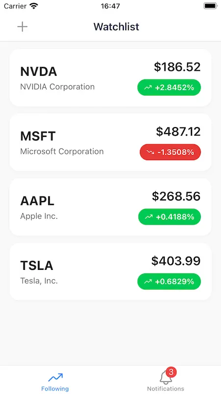
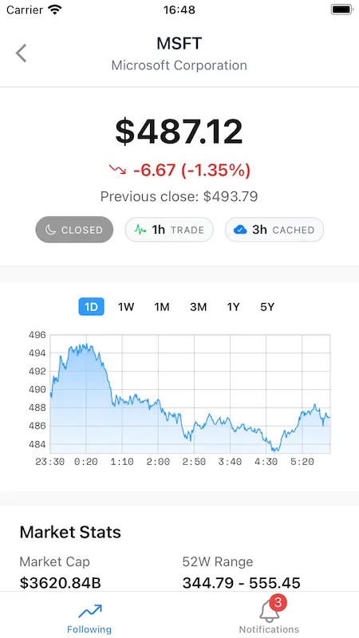

# React Native Finance Tracker

A sample finance application built with **Expo** and **React Native**. This app allows users to track stock tickers and view historical performance graphs.

It functions as the client-side interface for the [Python Finance Server](https://github.com/supershaneski/python-finance-server).


## Screenshots

| Watchlist | Stock Detail & History |
|:---:|:---:|
|  |  |

## Key Features

* **Ticker Tracking:** Monitor stock symbols and current prices.
* **Interactive Graph:** Visualize historical stock data using **Victory Native**.
* **Simple Caching:** Implements client-side caching via **Zustand Persist** to minimize network requests and ensure offline availability.

## Tech Stack

* **Framework:** React Native ([Expo SDK](https://github.com/expo/expo/tree/main/templates/expo-template-tabs))
* **State Management:** [Zustand (with Persist middleware)](https://zustand.docs.pmnd.rs/integrations/persisting-store-data)
* **Charts:** [Victory Native XL](https://nearform.com/open-source/victory-native/docs/)
* **Backend:** [Python Finance Server](https://github.com/supershaneski/python-finance-server) (External API)

## API Integration

This application consumes data from our [custom Python backend](https://github.com/supershaneski/python-finance-server).

### Endpoints Used

| Method | Endpoint | Description |
| :--- | :--- | :--- |
| `GET` | `/api/ticker?id=<symbol>` | Retrieves current data for a specific stock. |
| `GET` | `/api/tickers?symbols=<symbol1,symbol2,...>` | Refreshes data for multiple tickers (watchlist). |
| `GET` | `/add/history?id=<symbol>` | Fetches historical data points for the graph. |


## Installation

Clone the repository and install the dependencies:
```sh
git clone https://github.com/supershaneski/reactnativefinanceapp.git
cd reactnativefinanceapp
npm install
```

Copy the example file `.env.example` to `.env` in the project root:
```sh
cp .env.example .env  # Linux/macOS
copy .env.example .env  # Windows
```

Set the server IP address and port:
```env
EXPO_PUBLIC_BASEURL=http://your_server_ipaddress:8000
```

Run the app:
```sh
npx expo start --clear
```

> [!Note]
> Ensure the [backend server](https://github.com/supershaneski/python-finance-server#setup) is running locally or accessible remotely before starting the app.


## Future Roadmap

* [ ] **AI Integration:** Implement stock analysis and insights powered by **Gemini AI**.
* [ ] **Push Notifications:** Add push notifications handler.

## License

This project is licensed under the MIT License.
